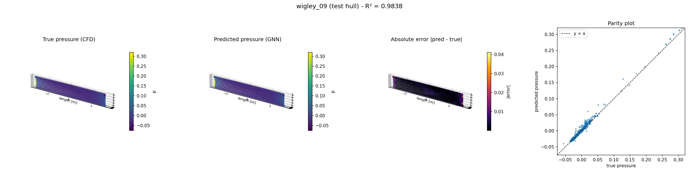
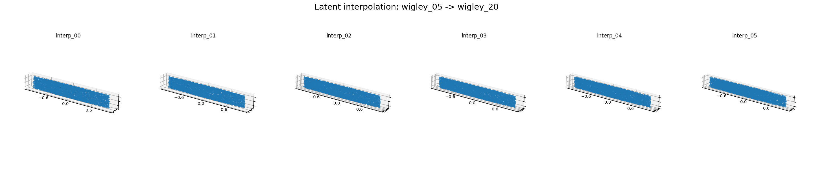

# FOILNET

FOILNET is a physical-AI portfolio project: four independent machine-learning approaches to ship-hull hydrodynamics, each trained on the same self-generated OpenFOAM CFD dataset — 40 Wigley hulls swept by Latin Hypercube Sampling. CFD is accurate but slow (a single RANS solve takes tens of minutes), which makes it impractical inside a design-optimization loop that needs thousands of evaluations. Each pillar attacks a different piece of the "replace/augment CFD with a fast surrogate" problem — surface loads, full volumetric flow, compact shape representation, and generative shape design — using a genuinely different technique: graph neural networks, Fourier neural operators, and point-cloud autoencoders (plain and variational).

## Data pipeline

Every pillar starts from the same automated batch factory:

1. **Parametric hull generation** (`scripts/generate_hull_batch.py`) — Wigley hulls sampled by Latin Hypercube Sampling (seed 42) over length `L ∈ [4, 8] m`, beam ratio `B/L ∈ [0.07, 0.13]`, draft ratio `T/L ∈ [0.045, 0.08]`. Produces 40 STL geometries + `manifest.csv`.
2. **OpenFOAM CFD** (`scripts/run_batch_cfd.sh`) — double-model (free-surface-free) RANS solve, k-ω SST turbulence, Re ≈ 1e6, meshed and solved per hull inside a Docker OpenFOAM 11 container.
3. **Per-pillar data conversion** — the same CFD output feeds three different representations:
   - hull surface faces → graph nodes (`scripts/convert_batch_graphs.py`, pillar 1)
   - CFD volume → regular 3D grid, interpolated with pyvista (`scripts/convert_batch_grids.py`, pillar 2)
   - hull STL → normalized 2048-point surface point cloud (`scripts/stl_to_pointcloud.py`, pillars 3 & 4)

## Pillar 1 — mesh GNN (surface pressure)

`HullGNN` is a 4-layer GraphSAGE network that treats the hull's surface mesh as a graph — each face is a node with 7 geometry features (position, normal, area) — and predicts the CFD-solved surface pressure directly, replacing a tens-of-minutes RANS solve with a millisecond forward pass. A 5-hull generalization test (train on 4, hold out 1) reached test R² = 0.954; scaling to the full 40-hull dataset (32 train / 8 held-out) gave a pooled test R² = 0.844, with 7 of 8 test hulls scoring between 0.82 and 0.99. The one exception, `wigley_03`, degrades sharply (R² < 0) — it sits at a corner of the sampled parameter space (the longest, most slender hull), which the training set under-represents. That's an honest extrapolation failure, not a bug: it's the expected limit of any data-driven surrogate at the boundary of its training distribution.



## Pillar 2 — neural operator (volume flow field)

`FNO3d` predicts the full 3D volumetric flow field (`Ux, Uy, Uz, p`) on a regular 32×16×16 grid using truncated-Fourier-mode spectral convolutions instead of message-passing — a fundamentally different inductive bias for the same underlying PDE. Both the training loss and the reported R² are computed only over fluid cells (the hull interior is masked out), and targets are standardized per-channel using training-only statistics. The pooled test R² comes out at 0.999992, but that number is misleading on its own: the per-channel breakdown shows `Ux` (R² = 0.22) is far harder than `Uy`, `Uz`, or `p` (0.83–0.89), because `Ux` is a near-uniform freestream (≈1.0) with only a small-amplitude wake signature riding on top — trivially predicting "≈1" already explains almost all of the pooled variance, while the genuinely hard signal is the small perturbation on top of it.

## Pillar 3 — geometry representation (point-cloud autoencoder)

A PointNet-style autoencoder (`PointCloudAE`) compresses each hull's 2048-point surface sample — 6144 numbers — into a 16-dimensional latent vector and reconstructs it: shared per-point MLP (3→64→128→256→512) → global max-pool → FC bottleneck → FC decoder back to 2048×3 points. Held-out Chamfer distance is 0.0123, close to the training value (0.0077) and consistent across all 8 test hulls (0.011–0.013, no outliers) — the 16-dim latent space generalizes to unseen hull shapes without collapsing. This pillar exists specifically to be the foundation for pillar 4: a compact, learned shape space that can be sampled or interpolated to generate new geometry.

## Pillar 4 — generative (point-cloud VAE)

`PointCloudVAE` reuses the pillar-3 PointNet backbone but adds a variational bottleneck (mu/logvar heads + reparameterization), trained with Chamfer reconstruction loss plus a KL term. `generate.py` demonstrates two generative modes: sampling random latent vectors (`z ~ N(0, I)`) and decoding them into novel hull shapes, and linearly interpolating between two real hulls' encoded latent codes. The first trained checkpoint (`beta = 0.001`) suffered posterior collapse — every one of the 40 hulls encoded to nearly the same latent point (per-dimension std ≈ 1e-4, pairwise distances ≈ 0.001) — and a KL-warmup schedule alone didn't fix it. Comparing against pillar 3's plain autoencoder (no KL term, pairwise distances ≈ 0.4–0.5) isolated the KL term as the cause; dropping `beta` to 0.0001 fixed it (pairwise distances ≈ 1.1–1.2, matching the AE's scale), and the interpolation below now shows a real, progressive shape change instead of six identical outputs.



## Repo structure

```
openfoam/                     OpenFOAM case template, generated hull geometries, per-hull CFD run dirs
  cases/wigley/                clean case template (0/, constant/, system/)
  geometries/batch/            generated hull STLs + manifest.csv (LHS parameters)
  runs/                        per-hull CFD run directories (mesh + solve + VTK output)

src/foilnet/
  data/mesh_to_graph.py         VTK hull surface -> PyG graph conversion (pillar 1)
  pillars/
    mesh_gnn/                   Pillar 1: HullGNN (GraphSAGE surface-pressure model)
    neural_operator/             Pillar 2: FNO3d (volume flow field), vtk_to_grid.py, dataset_grid.py, train_fno.py
    geometry_repr/               Pillar 3: PointCloudAE, chamfer.py, dataset_pc.py, train_ae.py
    generative/                  Pillar 4: PointCloudVAE, train_vae.py, generate.py (sample / interp)
  training/                    mesh_gnn training scripts (overfit sanity check, leave-one-out, full dataset)

scripts/                      batch hull generation, CFD batch runner, per-pillar data conversion, visualization
data/processed/                converted per-pillar data + trained checkpoints (*.pt)
reports/figures/               prediction / generation visualizations
```

## Reproduce

All commands run from the repo root; scripts that import `foilnet.pillars.*` need `PYTHONPATH=src`.

```bash
# 1. Generate 40 hulls via LHS (Mac)
python3 scripts/generate_hull_batch.py --n 40

# 2. Mesh + solve every hull (inside the OpenFOAM 11 Docker container)
scripts/run_batch_cfd.sh

# --- Pillar 1: mesh GNN ---
python3 scripts/convert_batch_graphs.py
PYTHONPATH=src python3 src/foilnet/training/train_dataset.py
PYTHONPATH=src python3 scripts/visualize_prediction.py wigley_09

# --- Pillar 2: neural operator ---
python3 scripts/convert_batch_grids.py
PYTHONPATH=src python3 src/foilnet/pillars/neural_operator/train_fno.py

# --- Pillar 3: geometry representation ---
python3 scripts/stl_to_pointcloud.py
PYTHONPATH=src python3 src/foilnet/pillars/geometry_repr/train_ae.py

# --- Pillar 4: generative ---
PYTHONPATH=src python3 src/foilnet/pillars/generative/train_vae.py
PYTHONPATH=src python3 src/foilnet/pillars/generative/generate.py --mode sample --k 5
PYTHONPATH=src python3 src/foilnet/pillars/generative/generate.py --mode interp --hull_a wigley_05 --hull_b wigley_20
python3 scripts/plot_pointclouds.py "data/processed/generated/interp_*.npy" vae_interp_wigley05_to_wigley20.png
```
