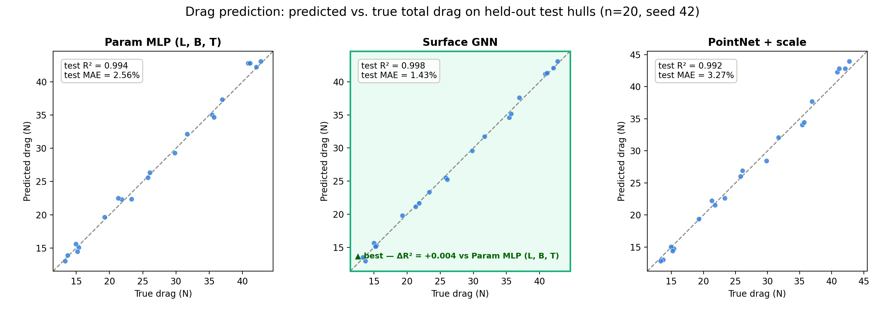
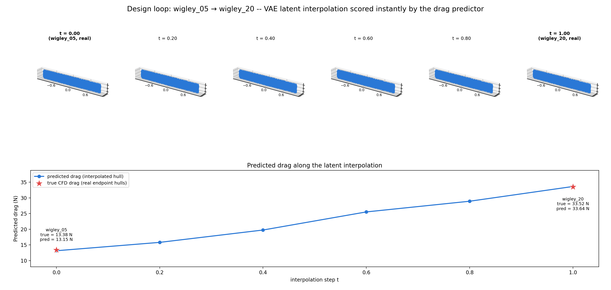

# HullNet

HullNet is a physical-AI portfolio project: four independent machine-learning approaches to ship-hull hydrodynamics, each trained on the same self-generated OpenFOAM CFD dataset — 100 Wigley hulls swept by Latin Hypercube Sampling. CFD is accurate but slow (a single RANS solve takes tens of minutes), which makes it impractical inside a design-optimization loop that needs thousands of evaluations. Each pillar attacks a different piece of the "replace/augment CFD with a fast surrogate" problem — surface loads, full volumetric flow, compact shape representation, and generative shape design — using a genuinely different technique: graph neural networks, Fourier neural operators, and point-cloud autoencoders (plain and variational). On top of that foundation, two further results push the project from "per-field surrogate" to "design tool": a model that predicts a hull's total drag straight from its surface geometry, and a full generative design loop that goes from an imagined hull to a predicted drag with no CFD in between.

## Headline results

These are the strongest results in the project, built on top of the four-pillar foundation described below.

### Drag prediction: geometry → total drag

Three models predict a hull's total drag (pressure + viscous) directly, each from a different input representation, all evaluated on the same held-out 20% of hulls (seed 42):

| model | input | test R² | test MAE |
|---|---|---|---|
| Param MLP (baseline) | 3 hand-picked parameters (L, B, T) | 0.994 | 2.56% |
| **Surface GNN** | raw surface graph — face positions, normals, areas, mesh adjacency | **0.998** | **1.43%** |
| PointNet + scale | 2048-point surface cloud + (L, B, T) | 0.992 | 3.27% |



The result that matters: the surface GNN beats the 3-parameter baseline **without ever being given L, B, T** — it only ever sees raw geometry (face positions, normals, areas, adjacency). A model that needs L/B/T is fundamentally limited to hulls describable by those three numbers; a model that reads geometry directly generalizes to free-form hulls where no clean parametrization exists — including hulls sampled straight out of the generative pillar's latent space, as the design loop below demonstrates.

### Design loop (capstone): imagine a hull, get its drag instantly

`design_loop.py` chains all four pillars end-to-end: the generative pillar's VAE decodes a latent code into a brand-new hull point cloud, and that point cloud is scored directly by the drag pillar's `PointCloudDrag` model — no meshing step, no CFD solve, no manual parameterization in between.



Interpolating between two real hulls (`wigley_05` → `wigley_20`) and scoring every point along the way: both endpoints' predicted drag lines up closely with their true CFD values (13.15 N predicted vs. 13.38 N true; 33.64 N vs. 33.52 N), and predicted drag varies smoothly across the four synthetic hulls in between rather than jumping around. Honest caveat: those in-between hulls have no CFD ground truth — nobody has ever solved for them — so their "predicted drag" is a surrogate estimate, not a validated number. The demonstration is speed (an instant score for a hull that doesn't exist yet), not that the intermediate values carry the same certainty as the endpoints.

## Data pipeline

Every pillar starts from the same automated batch factory:

1. **Parametric hull generation** (`scripts/generate_hull_batch.py`) — Wigley hulls sampled by Latin Hypercube Sampling (seed 42) over length `L ∈ [4, 8] m`, beam ratio `B/L ∈ [0.07, 0.13]`, draft ratio `T/L ∈ [0.045, 0.08]`. Produces 100 STL geometries + `manifest.csv`.
2. **OpenFOAM CFD** (`scripts/run_batch_cfd.sh`) — double-model (free-surface-free) RANS solve, k-ω SST turbulence, Re ≈ 1e6, meshed and solved per hull inside a Docker OpenFOAM 11 container.
3. **Per-pillar data conversion** — the same CFD output feeds three different representations:
   - hull surface faces → graph nodes (`scripts/convert_batch_graphs.py`, pillar 1 and the drag GNN)
   - CFD volume → regular 3D grid, interpolated with pyvista (`scripts/convert_batch_grids.py`, pillar 2)
   - hull STL → normalized 2048-point surface point cloud (`scripts/stl_to_pointcloud.py`, pillars 3 & 4 and the PointNet+scale drag model)
4. **Drag collection** (`scripts/collect_drag.py`) — parses each hull's OpenFOAM force output and merges it with `manifest.csv` into `data/processed/drag.csv` (L, B, T, pressure/viscous/total drag) — the ground truth for the drag-prediction models.

## Pillar 1 — mesh GNN (surface pressure)

`HullGNN` is a 4-layer GraphSAGE network that treats the hull's surface mesh as a graph — each face is a node with 7 geometry features (position, normal, area) — and predicts the CFD-solved surface pressure directly, replacing a tens-of-minutes RANS solve with a millisecond forward pass. A 5-hull generalization test (train on 4, hold out 1) reached test R² = 0.954; scaling to the full 40-hull dataset (32 train / 8 held-out) gave a pooled test R² = 0.844, with 7 of 8 test hulls scoring between 0.82 and 0.99. The one exception, `wigley_03`, degrades sharply (R² < 0) — it sits at a corner of the sampled parameter space (the longest, most slender hull), which the training set under-represents. That's an honest extrapolation failure, not a bug: it's the expected limit of any data-driven surrogate at the boundary of its training distribution.


## Pillar 2 — neural operator (volume flow field)

`FNO3d` predicts the full 3D volumetric flow field (`Ux, Uy, Uz, p`) using truncated-Fourier-mode spectral convolutions instead of message-passing — a fundamentally different inductive bias for the same underlying PDE. The CPU workflow trains on a coarse 32×16×16 grid; `notebooks/kaggle_train_fno.ipynb` retrains the same model at a much higher 64×32×32 resolution on the full 100-hull dataset on a Kaggle T4 GPU. Both the training loss and the reported R² are computed only over fluid cells (the hull interior is masked out), and targets are standardized per-channel using training-only statistics.

At 64×32×32 / 100 hulls, the pooled test R² comes out at ≈0.9999 — but that number is misleading on its own: the freestream region (`Ux ≈ 1`, `p ≈ 0` over most of the domain) dominates the cell count, so a model that just predicts "≈freestream everywhere" already explains almost all of the pooled variance. The per-channel breakdown is the metric that actually reflects difficulty: `p` = 0.92, `Uy` = 0.96, `Uz` = 0.95, and `Ux` = 0.78 is the hardest by a wide margin — `Ux` is a near-uniform freestream with only a small-amplitude wake perturbation riding on top, so almost all of that channel's genuine variance is in the small signal the model has to resolve on top of an already-trivial baseline.

## Pillar 3 — geometry representation (point-cloud autoencoder)

A PointNet-style autoencoder (`PointCloudAE`) compresses each hull's 2048-point surface sample — 6144 numbers — into a 16-dimensional latent vector and reconstructs it: shared per-point MLP (3→64→128→256→512) → global max-pool → FC bottleneck → FC decoder back to 2048×3 points. Held-out Chamfer distance is 0.0123, close to the training value (0.0077) and consistent across all 8 test hulls (0.011–0.013, no outliers) — the 16-dim latent space generalizes to unseen hull shapes without collapsing. This pillar exists specifically to be the foundation for pillar 4: a compact, learned shape space that can be sampled or interpolated to generate new geometry.

## Pillar 4 — generative (point-cloud VAE)

`PointCloudVAE` reuses the pillar-3 PointNet backbone but adds a variational bottleneck (mu/logvar heads + reparameterization), trained with Chamfer reconstruction loss plus a KL term. `generate.py` demonstrates two generative modes: sampling random latent vectors (`z ~ N(0, I)`) and decoding them into novel hull shapes, and linearly interpolating between two real hulls' encoded latent codes. The first trained checkpoint (`beta = 0.001`) suffered posterior collapse — every one of the 40 hulls encoded to nearly the same latent point (per-dimension std ≈ 1e-4, pairwise distances ≈ 0.001) — and a KL-warmup schedule alone didn't fix it. Comparing against pillar 3's plain autoencoder (no KL term, pairwise distances ≈ 0.4–0.5) isolated the KL term as the cause; dropping `beta` to 0.0001 fixed it (pairwise distances ≈ 1.1–1.2, matching the AE's scale), and the interpolation below now shows a real, progressive shape change instead of six identical outputs.


## Repo structure

```
openfoam/                     OpenFOAM case template, generated hull geometries, per-hull CFD run dirs
  cases/wigley/                clean case template (0/, constant/, system/)
  geometries/batch/            generated hull STLs + manifest.csv (LHS parameters)
  runs/                        per-hull CFD run directories (mesh + solve + VTK output)

src/hullnet/
  data/mesh_to_graph.py         VTK hull surface -> PyG graph conversion (pillar 1)
  pillars/
    mesh_gnn/                   Pillar 1: HullGNN (GraphSAGE surface-pressure model)
    neural_operator/             Pillar 2: FNO3d (volume flow field), vtk_to_grid.py, dataset_grid.py, train_fno.py
    geometry_repr/               Pillar 3: PointCloudAE, chamfer.py, dataset_pc.py, train_ae.py
    generative/                  Pillar 4: PointCloudVAE, train_vae.py, generate.py (sample / interp), design_loop.py (capstone)
    drag/                        Drag prediction: DragMLP, HullDragGNN, PointCloudDrag, dataset_drag.py, train_*.py
  training/                    mesh_gnn training scripts (overfit sanity check, leave-one-out, full dataset)

scripts/                      batch hull generation, CFD batch runner, per-pillar data conversion, drag collection, visualization
notebooks/                    kaggle_train_fno.ipynb -- GPU FNO training at 64x32x32
data/processed/                converted per-pillar data + trained checkpoints (*.pt)
reports/figures/               prediction / generation visualizations
```

## Reproduce

All commands run from the repo root; scripts that import `hullnet.pillars.*` need `PYTHONPATH=src`.

```bash
# 1. Generate 100 hulls via LHS (Mac)
python3 scripts/generate_hull_batch.py --n 100

# 2. Mesh + solve every hull (inside the OpenFOAM 11 Docker container)
scripts/run_batch_cfd.sh

# --- Pillar 1: mesh GNN ---
python3 scripts/convert_batch_graphs.py
PYTHONPATH=src python3 src/hullnet/training/train_dataset.py
PYTHONPATH=src python3 scripts/visualize_prediction.py wigley_09

# --- Pillar 2: neural operator ---
python3 scripts/convert_batch_grids.py
PYTHONPATH=src python3 src/hullnet/pillars/neural_operator/train_fno.py

# Higher-resolution GPU variant (64x32x32, trained on a Kaggle T4):
python3 scripts/convert_batch_grids.py --nx 64 --ny 32 --nz 32
# then run notebooks/kaggle_train_fno.ipynb on Kaggle (see the notebook header for GRID_DATA_DIR setup)

# --- Pillar 3: geometry representation ---
python3 scripts/stl_to_pointcloud.py
PYTHONPATH=src python3 src/hullnet/pillars/geometry_repr/train_ae.py

# --- Pillar 4: generative ---
PYTHONPATH=src python3 src/hullnet/pillars/generative/train_vae.py
PYTHONPATH=src python3 src/hullnet/pillars/generative/generate.py --mode sample --k 5
PYTHONPATH=src python3 src/hullnet/pillars/generative/generate.py --mode interp --hull_a wigley_05 --hull_b wigley_20
python3 scripts/plot_pointclouds.py "data/processed/generated/interp_*.npy" vae_interp_wigley05_to_wigley20.png

# --- Drag prediction (geometry -> total drag) ---
python3 scripts/collect_drag.py
PYTHONPATH=src python3 src/hullnet/pillars/drag/train_param_mlp.py
PYTHONPATH=src python3 src/hullnet/pillars/drag/train_drag_gnn.py
PYTHONPATH=src python3 src/hullnet/pillars/drag/train_pc_drag.py
PYTHONPATH=src python3 scripts/plot_drag_parity.py

# --- Design loop (capstone): VAE generate -> instant drag prediction ---
PYTHONPATH=src python3 src/hullnet/pillars/generative/design_loop.py --mode interp --hull_a wigley_05 --hull_b wigley_20
PYTHONPATH=src python3 scripts/plot_design_loop.py
```
